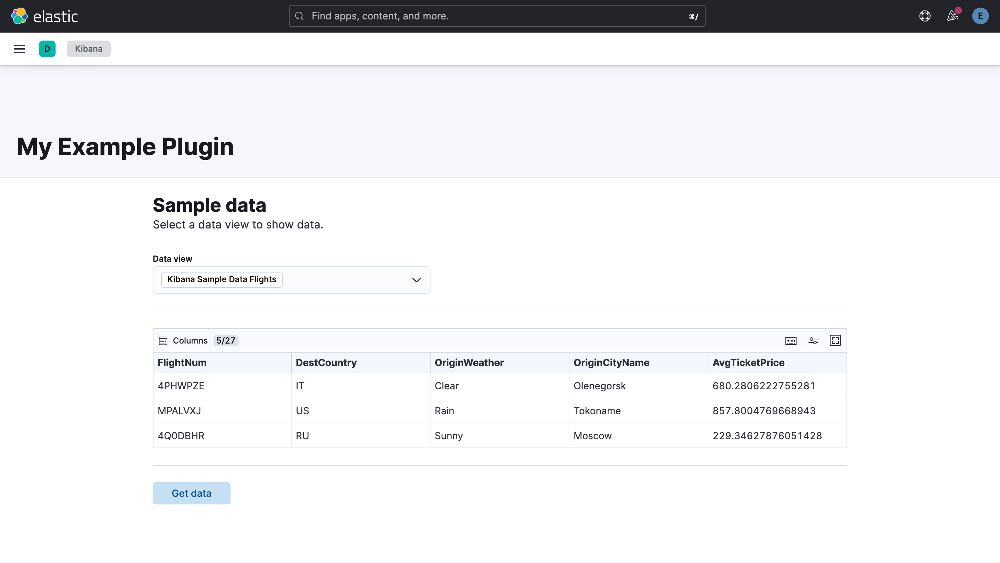

# kibana_example_plugin

An example Kibana plugin generated using the [Kibana Plugin Generator](https://www.elastic.co/guide/en/kibana/current/plugin-tooling.html#automatic-plugin-generator). This plugin shows rows from an Elasticsearch index, which is obtained using the corresponding Kibana data view:



This plugin has been built targeting Elasticsearch 8.14, *and therefore may not work for other versions*. Specifically, it uses the following plugins:

1. The core navigation plugin.
2. The public [data plugin](https://github.com/elastic/kibana/blob/8.14/src/plugins/data/README.mdx) allows for Elasticsearch indices to be queried.
3. The [unified search plugin](https://github.com/elastic/kibana/tree/8.14/src/plugins/unified_search) provides UI components for accessing Kibana data views.

## Why build a plugin

Building and maintaining your own Kibana plugins is a challenge, but can allow you to expand the existing capabilities of Kibana itself. While we do accept feature contributions, which are covered in the [contributing guide for the Kibana repo](https://github.com/elastic/kibana/blob/main/CONTRIBUTING.md), not every feature developers wish to add to Kibana is generic enough for the entire Elastic community to use.

The [plugin section of the Kibana documentation](https://www.elastic.co/guide/en/kibana/current/kibana-plugins.html) gives good examples of known plugins built over the years by developers in the community. Specifically, they tend to cover several key themes:

* Applications and utilities to view cluster and other monitoring information in a useful way.
* Custom visualizations for use in dashboards that are challenging or impossible to construct via capabilities such as [Lens](https://www.elastic.co/guide/en/kibana/current/lens.html), [TSVB](https://www.elastic.co/guide/en/kibana/current/tsvb.html) and [Vega](https://www.elastic.co/guide/en/kibana/current/vega.html).
* Tools for embedding different content types such as Markdown or Timelion.

Indeed, many Elasticians build plugins to develop some of the Elastic features you've come to love in recent years too. 

## Why not build a plugin

While it's great to have this ability to extend Kibana with your own features, it also exposes you to maintenance challenges for both your code and the cluster you install the plugin on, including:

* [As explicitly stated in the documentation](https://www.elastic.co/guide/en/kibana/current/kibana-plugins.html) backward compatibility for plugins is not guaranteed, and the responsibility lies with you as a developer to release a new version of your plugin for each Kibana release. Failing to do so can prevent you from upgrading your cluster if the plugin becomes a critical component in your ecosystem and the accrual of technical debt.
* Building slow or poorly performing plugins can slow down Kibana itself. For this reason, we have [performance considerations](https://www.elastic.co/guide/en/kibana/current/development-best-practices.html#_performance) listed in our documentation.
* It's easy to reinvent the wheel and rebuild features that may be there or can be adapted to your use case. Make sure you're not rebuilding an existing feature and, if you do build a plugin, use [the existing services and utilities](https://www.elastic.co/guide/en/kibana/current/development-best-practices.html#_re_inventing_the_wheel) when developing your plugin.
* Writing your own code can lead to the introduction of security vulnerabilities that could be used by nefarious actors to gain access to your cluster or data. Make sure you protect against common attacks and adhere to the [security best practices listed in our documentation](https://www.elastic.co/guide/en/kibana/current/security-best-practices.html).
* The scope of benefit for a plugin is often limited to your benefit rather than the whole community. For general features that are feature requests, it might be worth considering raising a pull request to the Kibana repo instead.

## Development

See the [Kibana contributing guide](https://github.com/elastic/kibana/blob/main/CONTRIBUTING.md) for instructions on setting up your development environment. Furthermore, for building a UI plugin you need to run the plugin [as per these steps](https://www.elastic.co/guide/en/kibana/current/plugin-tooling.html#_run_kibana_with_your_plugin_in_dev_mode) to pick up the browser bundles. Failing to do this will mean you'll see 404 and MIME-type errors similar to the below in your console:

```
GET http://localhost:5601/XXXXXXXXXXXX/bundles/plugin/kibanaExamplePlugin/1.0.0/kibanaExamplePlugin.plugin.js 404 (Not Found)

kibanaExamplePlugin:1 Refused to execute script from 'http://localhost:5601/XXXXXXXXXXXX/bundles/plugin/kibanaExamplePlugin/1.0.0/kibanaExamplePlugin.plugin.js' because its MIME type ('application/json') is not executable, and strict MIME type checking is enabled.
```

## Scripts

<dl>
  <dt><code>yarn kbn bootstrap</code></dt>
  <dd>Execute this to install node_modules and set up the dependencies in your plugin and in Kibana</dd>

  <dt><code>yarn plugin-helpers build</code></dt>
  <dd>Execute this to create a distributable version of this plugin that can be installed in Kibana</dd>

  <dt><code>yarn plugin-helpers dev --watch</code></dt>
    <dd>Execute this to build your plugin ui browser side so Kibana could pick up when started in development</dd>
</dl>

## Resources

Check out the below resources to learn about plugin development:

1. [Elastic EUI component library and design system for building plugins with a consistent look and feel to Kibana](https://eui.elastic.co/#/)
2. [Kibana Plugin Examples](https://github.com/elastic/kibana/tree/main/examples)
3. [Kibana Plugin Generator](https://www.elastic.co/guide/en/kibana/current/plugin-tooling.html#automatic-plugin-generator)
4. [Kibana Plugin Development Best Practices](https://www.elastic.co/guide/en/kibana/current/development-best-practices.html#_performance)
5. [Kibana Security Best Practices](https://www.elastic.co/guide/en/kibana/current/security-best-practices.html)